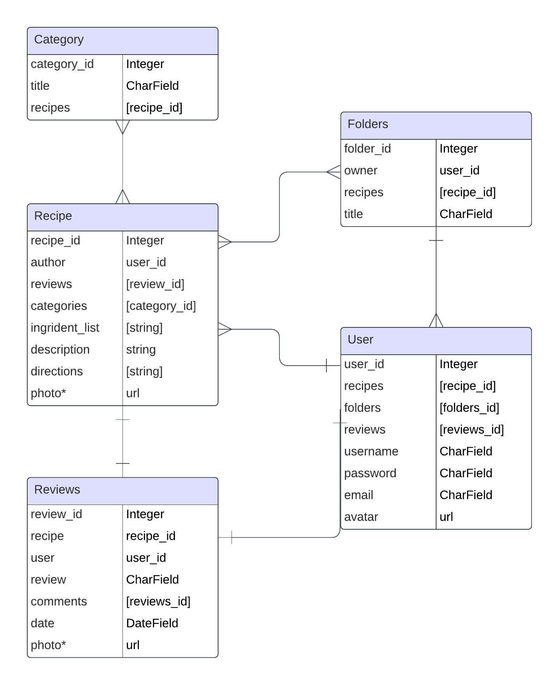

# Appetit

Appetit is an app for all things food. Fellow foodies can discover new recipes, share your own recipes and engage with the culinary community. Whether you're looking for weeknight dinner inspiration, planning a special occasion feast, or simply seeking culinary adventure, Appetit is your trusted companion in the kitchen. 

### Collaborators
* Noel Elias [GitHub](https://github.com/eliaswnoel) 
* Lillian Layne [GitHub](https://github.com/lillianlayne)

### Technologies Used
* Python
* Django
* JavaScript
* Tailwind CSS
* [Tasty API](https://publicapi.dev/tasty-api) 

### Database ERD

