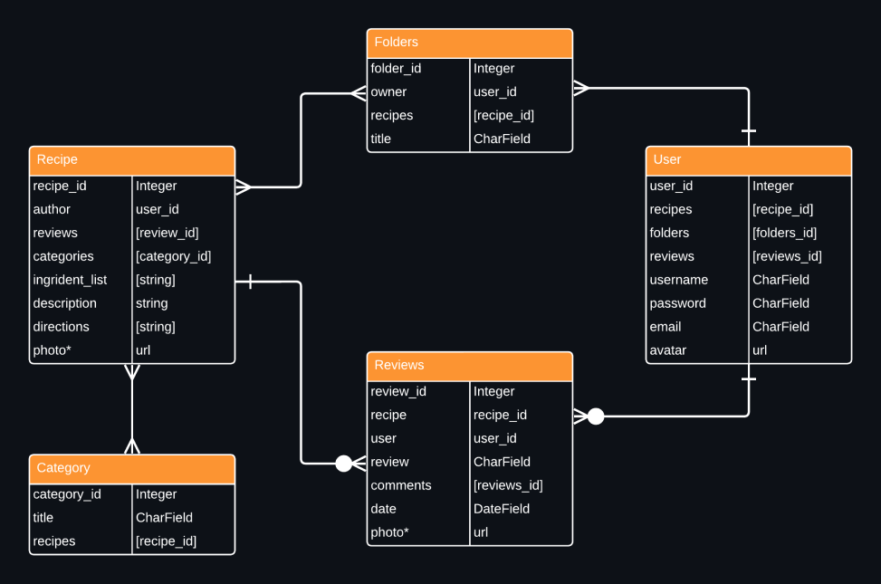

# Appetit

Appetit is an app for all things food. Fellow foodies can discover new recipes, share your own recipes and engage with the culinary community. Whether you're looking for weeknight dinner inspiration, planning a special occasion feast, or simply seeking culinary adventure, Appetit is your trusted companion in the kitchen. 

Appetit allows the user to personalize their accounts to their needs, whether it's sharing new recipes or collecting recipes for a rainy day.Users can create, create, update and share their own recipes. They can also view recipes to find their next dinner dish, and also save them into their own collections to come back to later.

## Collaborators

Noel Elias | [GitHub](https://github.com/eliaswnoel)  Lillian Layne | [GitHub](https://github.com/lillianlayne)

## Get Appetit
_currently underconstruction, previews to come_
 
Follow the production on our [Asana](https://app.asana.com/0/1207105408267258/1207105408267258) board 

## Technologies Used
Python  
Django 
JavaScript 
Tailwind CSS 
[Tasty API](https://publicapi.dev/tasty-api) 

## Wireframes
View [PitchDeck](https://pitchdeck.hypermatic.com/slides/lv5dbfcf23095/?token=aGFpRUVSMWJnbUFscCM=)

## Database ERD

## Features
1. __User Authentication__
2. __User Profile__: users can create profiles where they can manage their recipes, save favorites and categorize them
3. __Recipe Upload__: users can upload their personal recipes into the general database
4. __Search and Filter__: filter options so user can easily find recipes based on ingredients, instructions, and any additional notes
5. __Rating & Reviews__: users can rate and review recipes, providing valuable feedback to other users and helping them make informed choices.
6. __Recipe Collections__: enable users to create and curate collections of recipes based on themes, occasions, personal preferences or anything else of their choosing 

## Credits1

<<<<<<< HEAD
## Credits
>>>>>>> b141c7ce1fab99a9db2b6a4de33383f70a3115ca
=======
>>>>>>> 1551cc59e0db00c9cfb542d44281fc01103af78f
